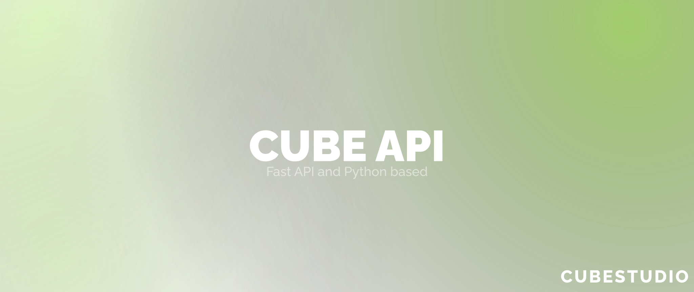

<h1 align="center">
  
  Cube API
  <br/>
</h1>

<p align="center">
    Rest API, которое используется в сервисах CubeStudio.
</p>

## Стек


## Дорожная карта Cube-API

* [X] Первый запуск Cube-API
* [X] Поддержка CurseForge
* [X] Dockerfile, docker-compose, контейнеризация Cube-API
* [ ] Дополнительный контент (Ресурспаки, Шейдеры, Конфиги) **(WIP)**
* [ ] Поддержка сторонних сервисов (например, Yandex.Drive, Google.Drive, Dropbox и т.д.)
* [ ] Добавление скачивания некоторых файлов напрямую с Cube-API, например конфигов
* [ ] Возможность наличия нескольких обновляемых Instances

## Полезные ссылки

* Телеграм-канал CubeStudio: https://t.me/+Gphg_BIJEdMwMmFi
* Сайт CubeStudio: [fadegor05.github.io/CubeStudio/](https://fadegor05.github.io/CubeStudio/)
* CubeStart: https://github.com/fadegor05/CubeStart

## Как работают Instance?

Что такое Instance? Instance — это исчерпывающие описание сборки Minecraft, содержащей в себе моды разных сервисов.

**Коллекция** `instances`:

```json
{
  "uuid": "0",
  // Индификатор проекта
  "name": "CubeShield Experiment: Example",
  // Название сборки
  "version": "0.0.1",
  // Версия сборки
  "changelog": "",
  // Изменения версии
  "game_version": "1.20.4",
  // Версия Minecraft
  "loader": "fabric"
  // Загрузчик Minecraft
}
```

**Коллекция** `mods`:

```json
{
    // Modrinth Мод
    "integration": "modrinth",
    "project": "simple-voice-chat", // Slug или ID мода
    "version": "fabric-1.20.4-2.5.1", // Slug или ID версии мода
    "side": "both"
},
{
    // CurseForge Мод
    "integration": "curseforge",
    "project": "298744", // ID проекта
    "version": "5082629", // ID файла мода
    "side": "both"
}
```

**Коллекция** `resourcepacks`:

```json
{
    // Modrinth Ресурспак
    "integration": "modrinth",
    "project": "simple-voice-chat", // Slug или ID ресурспака
    "version": "fabric-1.20.4-2.5.1", // Slug или ID версии ресурспака
    "side": "both"
},
{
    // CurseForge Ресурспак
    "integration": "curseforge",
    "project": "298744", // ID проекта
    "version": "5082629", // ID файла ресурспака
    "side": "both"
}
```

## Переменные среды

```
CURSEFORGE_API_KEY= # Ключ CurseForge Studios
BACKEND_PORT=8000 # Порт API

MONGO_ROOT_USER= # Логин MongoDB
MONGO_ROOT_PASS= # Пароль MongoDB
MONGO_PORT=4000 # Порт MongoDB
```

## Деплой

Клонирование репозитория Cube-API

```
git clone https://github.com/fadegor05/Cube-API.git
```

Перемещение в директорию репозитория

```
cd Cube-API
```

Сборка, запуск контейнера в фоновом режиме

```
docker-compose up --build -d
```

Остановка контейнера

```
docker container stop cube-api
```

###### Not an official Minecraft product. We are in no way affiliated with or endorsed by Mojang Synergies AB, Microsoft Corporation or other rightsholders.
